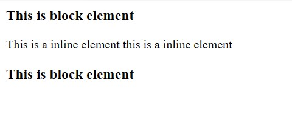
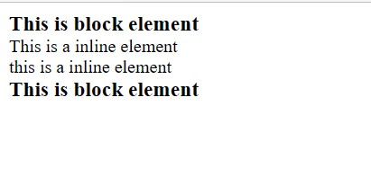

- **Elements** are the basis of document struture. In HTML most common elements are p, div, table, span.
    - There are only two categories of **Elements** **Replaced and non replaced**
        - **Replaced Elements** are those whose content is not present in the document itself. Example is img tag.
            ```
            
            ``` 
            this will get replaced by the howdy.gif GIF content in the HTML document which is not present in the document.
        - **Non replaced Elements** are those whose content is presented by **user agent**(generally a browser). **Majority** of elements are non replaced one in **HTML**. Example is span.
            ```
            <span>Hi Pratik</span>
            ```
            span is a non replaced element as the content is presented with the help of user agent.
        - In addition to **Replaced and Non Replaced** elements **CSS** used two other basic types of elements: **block-level** and **inline-level**. Basically there are two main display types in css **block** and **inline** refering to **block-level** and **inline-level** elemets types of **CSS**. There are multiple display types in **CSS** but these are two to which all refers.
            - **Block-Level** (*refering to display type block*).
            Block level element will **generate a BOX** fills the **parent area** and **creates break before and after itself**. Also block-level elements **can not have other elements** at it's sides both **before and after the BOX**.
            ```
            <h1>This is block</h1> 
            <span>this is a inline element</span>
            <span>this is a inline element</span> 
            <h1>This is block</h1>
            ``` 
            <br>

            - Mostly used values of **display** propery are,
              - display: block
              - display : inline
              - display : list-item
            - There are list of categories we have in display property.
              - display-outside
                - block | inline | run-in
              - display-inside
                - flow | flow-root | table | flex | grid | ruby
              - display-listitem
                - ```list-item && <display-outside>? && [ flow | flow-root ]?``` (Will discuss this in details later)
              - display-internal
                - table-row-group | table-header-group | table-footer-group | table-row |
                table-cell | table-column-group | table-column | table-caption | ruby-base
                | ruby-text | ruby-base-container | ruby-text-container
              - display-box
                - contents | none
              - display-legacy
                - inline-block | inline-list-item | inline-table | inline-flex | inline-grid
        - **By Default the display property** of each and every elemet in HTML is **fixed implicitly,** and that can be one of the values defined above.
        - **But if you are considering CSS** there is **no such restrictions** we can change display property of any html element by **specifying explicitly display property** of a HTML tag
            ```
            <h3 style="display: inline;">This is block element</h3> 
            <span style="display: block;">This is a inline element</span> 
            <span style="display: block;">this is a inline element</span>
            <h3 style="display: inline;">This is block element</h3>
            ```
            <br>
            - **Note:** in above example **h3** tag has been specified to get **displayed in inline** and **span** has **created a break** **before** and **after** it's own content. As **break has been created by span before it's content** this is a inline element has been displayed on next line **explicitly**.