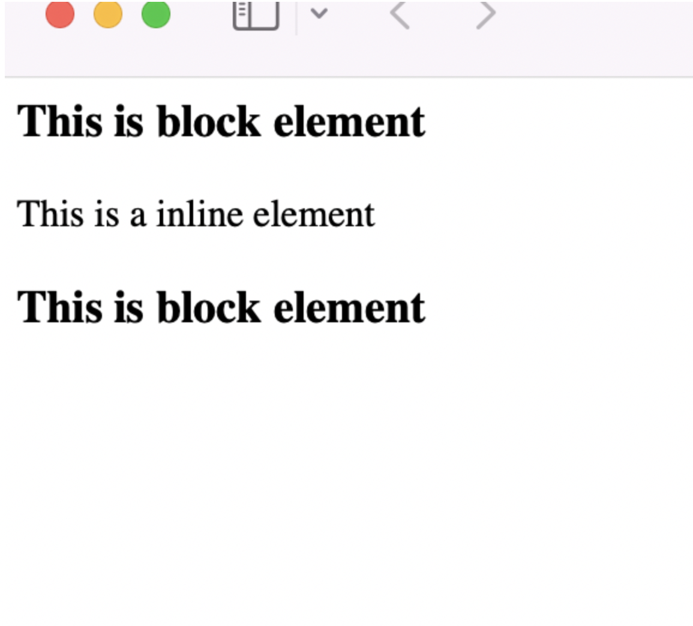

- **Elements** are the basis of document struture. In HTML most common elements are p, div, table, span.
    - There are only two categories of **Elements** **Replaced and non replaced**
        - **Replaced Elements** are those whose content is not present in the document itself. Example is img tag.
            ```
            
            ``` 
            this will get replaced by the howdy.gif GIF content in the HTML document which is not present in the document.
        - **Non replaced Elements** are those whose content is presented by **user agent**(generally a browser). **Majority** of elements are non replaced one in **HTML**. Example is span.
            ```
            <span>Hi Pratik</span>
            ```
            span is a non replaced element as the content is presented with the help of user agent.
        - In addition to **Replaced and Non Replaced** elements **CSS** used two other basic types of elements: **block-level** and **inline-level**. Basically there are two main display types in css **block** and **inline** refering to **block-level** and **inline-level** elemets types of **CSS**. There are multiple display types in **CSS** but these are two to which all refers.
            - **Block-Level** (*refering to display type block*).
            Block level element will **generate a BOX** fills the **parent area** and **creates break before and after itself**. Also block-level elements **can not have other elements** at it's sides both **before and after the BOX**.
            ```
            <h1>This is block</h1> 
            <span>this is a inline element</span> 
            <h1>This is block</h1>
            ``` 
            