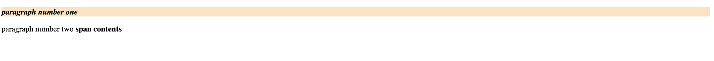
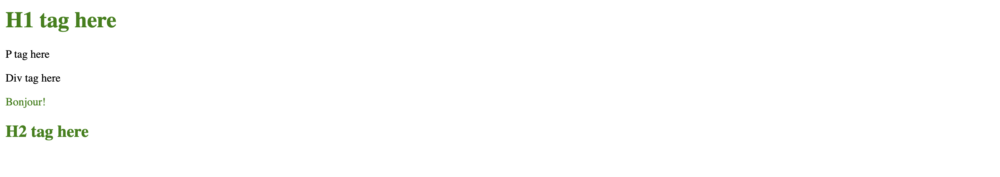
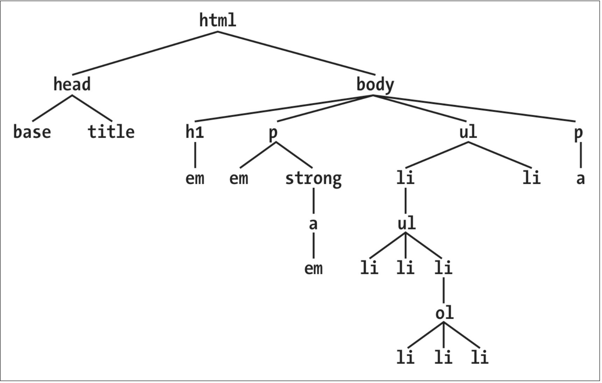
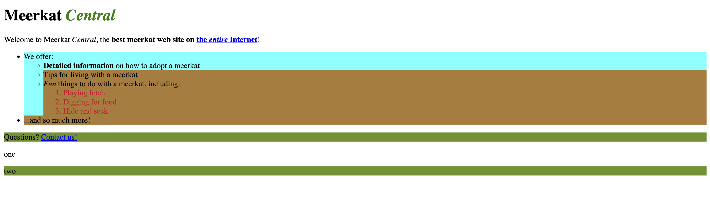

### **Selectors**
- **Element Selector**
    - <u>Single tag selector</u>
        - html
            ```
            <p>
                hi there
            </p>
            ```
        - css
            ```
            p{
            color: green;
            }
            ```
    - <u>Multi tag selector</u>: you can select as many tags given below there is no limit 
        - css
            ```
            body, div, p, table, th, td, h1, h2{
                color: gray;
            }
            ```
- **Class Selector**
    - <u>Class selector</u>
        - html
            ```
            <p class = "paragraph-selector">
                hi there
            </p>
            ```
        - css
            ```
            .paragraph-selector{
                color: green;
            }

            OR

            p.paragraph-selector{
                color: green;
            }
            ```
    - <u>Multiple class selector</u>
        - html
            ```
            <p class="urgent warning">paragraph number one
            </p>
            <p>paragraph number two
                <span class="warning">
                    span contents
                </span>
            </p>
            ```
        - css
            ```
            .urgent{
                font-style: italic;
            } .warning{
                font-weight: bold;
            }
            .urgent.warning{
                background-color: bisque;
            }
            ```
            
- **Id Selector** you can not have two ID's assigned to one tag.
    - html
        ```
        <p id = "unique-ID1">ID selector here..</p>
        ```
    - css
        ```
        #unique-ID1{
            color: blue;
        }
        ```
- **Attribute Selector**
    - <u>Simple attribute selector</u>
        - html
            ```
            <p id = "unique-ID1" class="testing">ID selector here...</p>
            ```
        - css
            ```
            p[id]{
                color: red;
                font-weight: bold;
            }

            OR

            p[id][class]{
                color: red;
                font-weight: bold;
            }

            Discussion: You can add multiple attribute to get desired tag selection.
            ```
    - <u>Selection based on exact value</u>
        - html
            ```
            <p id = "unique-ID1" class="testing">ID selector here...</p>
            ```
        - css
            ```
            p[id = "unique-ID1"]{
                color: red;
                font-weight: bold;
            }

            OR
            
            p[id = "unique-ID1"][class="testing"]{
                color: red;
                font-weight: bold;
            }


            Discussion: We gave id = unique-ID1 for exact selection. Another approach is to give multiple attributes with there exact values.
            ```
    - **selection based on partial values**
    - <u>A particular attribute type selection type.</u>
        - html
            ```
            <p lang="fr">Value starting with or exactly euqal</p>
            <p lang="en-us">Value ending with</p>
            <p lang="ta-au">Value only starting with</p>
            <p testing="pratik">pratik testing for contains</p>
            <p testing="tik lav hale">value containing space seprated list</p>
            ```
        - css
            ```
            *[lang|='fr']{
                color: green;
            }

            *[lang$='us']{
                color: brown;
            }

            *[lang^='ta']{
                color:deeppink;
            }

            *[testing*='pr']{
                background-color: burlywood;
            }

            *[testing~='lav']{
                background-color: rgb(223, 108, 55);
            }

            Discussion: tag text itself is self explanatory.
            ```
            
    - <u>The Case Insensitivity Identifier</u>
        - css
            ```
            *[lang|='fr' i]{
                color: green;
            }

            *[lang$='us' i]{
                color: brown;
            }

            *[lang^='ta' i]{
                color:deeppink;
            }

            *[testing*='pr' i]{
                background-color: burlywood;
            }

            *[testing~='lav' i]{
                background-color: rgb(223, 108, 55);
            }

            Discussion: If we are putting i before clossing of "]" brackets then we are checking the text with case insensitive. All other rules are the same.
            ```
- **Using Document Selector(do not read this)** we need to understand the relation ship of selectors and document here.
    ```
    <html>

    <head>
        <base href="http://www.meerkat.web/">
        <title>Meerkat Central</title>
    </head>

    <body>
        <h1>Meerkat <em>Central</em></h1>
        <p>
            Welcome to Meerkat <em>Central</em>, the <strong>best meerkat web site on <a href="inet.html">the
                    <em>entire</em> Internet</a></strong>!
        </p>
        <ul>
            <li>We offer: <ul>
                    <li><strong>Detailed information</strong> on how to adopt a meerkat</li>
                    <li>Tips for living with a meerkat</li>
                    <li><em>Fun</em> things to do with a meerkat, including:
                        <ol>
                            <li>Playing fetch</li>
                            <li>Digging for food</li>
                            <li>Hide and seek</li>
                        </ol>
                    </li>
                </ul>
            </li>
            <li>...and so much more!</li>
        </ul>
        <p>
            Questions? <a href="mailto:suricate@meerkat.web">Contact us!</a> </p>
    </body>

    </html>
    ```
    <br>
    - An element is said to be the parent of another element if it appears directly above that element in the document hierarchy.
    - If there is a one level relation among tags then they are called as **parent-child.**<br>
    - If there is a multi level relation among tags then they are called as **ancestor-descendant**
    - <u>Selecting Children</u>
        - css
            ```
            ul > li {
                background-color: aqua;
            }

            Discussion: li element after ul is getting selected with the help of child selector. For HTML refer above code.
            ```
    - <u>Selecting Adjcent Siblings</u>
        - css
            ```
            li + li{
                background-color: rgb(181, 126, 59);
            }

            Discussion: selecting last two li's from the entire html where ever you are getting li stacked inside one tag there apply the css to last two elements.
            ```
    - <u>Selecting Following Siblings</u>
        - css
            ```
            p ~ p{
                background-color: rgb(103, 146, 40);
            }

            Discussion: After p if you have any tags    
            ```
        <br>


    
    

    