### **Pseudo-Class Selectors**
- **Combining pseudo class selectors**
    -  *we can combine multiple pseudo class selectors* 
        ```
        a:link:hover {color: red;} 
        a:visited:hover {color: maroon;}
        a:link:hover:lang(de) {color: gray;} 
        a:visited:hover:lang(de) {color: silver;}

        Discussion: we have combined (link, hover, lang), (visited, hover, lang) this is possible in css.
        ```
- **Structural pseudo class selector**
    - **Selecting the root element**
        - css
            ```
            :root {border: 10px dotted gray;}
            ```
    - **Selecting unique children**(*only-of-type is pending we have not covered it yet*)
        - html
            ```
            <a href="http://w3.org/"></a>
            <a href="http://w3.org/"> The W3C</a>
            <a href="http://w3.org/"> <em>The W3C</em></a>
            ```
        - css
            ```
            a[href] img:only-child {border: 2px solid black;}

            Discussion: if you want to select a tag which is only-one-child of a parent then you can use :only-child pseudo selector. In above example we have selected only img which is comming after a.
            ```
    - **Selecting first and last child.**(*we have not complete Selecting first and last of a type yet*)
        - html
            ```
            <div>
                <p>These are the necessary steps:</p>
                <ul>
                    <li>Insert key</li>
                    <li>Turn key <strong>clockwise</strong></li>
                    <li>Push accelerator</li>
                </ul>
                <p>
                    Do <em>not</em> push the brake at the same time as the accelerator. </p>
            </div>
            ```
        - css
            ```
            p:first-child {
            font-weight: bold;
            }
            li:first-child {
            text-transform: uppercase;
            }
            p:last-child {
            font-weight: bold;
            }
            li:last-child {
            text-transform: uppercase;
            }
            ```
        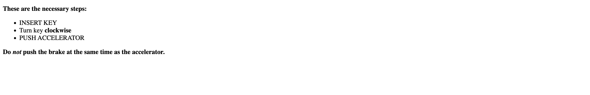<br>
    - **selecting evey nth child**
        - css
            ```
            li:nth-child(2n + 1) {
            background-color: aqua;
            }

            li:nth-child(2n) {
            background-color: rgb(161, 161, 220);
            }

            li:nth-child(1):nth-last-child(4) ~ li {
            width: 25%;
            }

            Discussion: 2n will select event , 2n + 1 will select odd rows, n will select nth row

            after getting a element you can also go for siblings selector. As given in the last selector.
            ```
        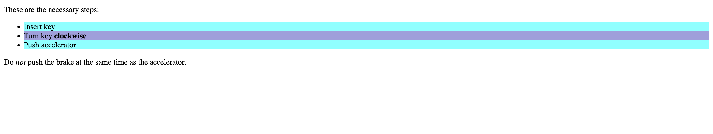<br>
- **Dynamic pseudo selector** If you want to apply styles to a document based on something in addition to the structure of the document. For example if you want to change the link after visiting it.
    - <u>Hyperlink pseudo classes</u>
        - html
            ```
            <a href="./01 forSlibingConfussion.html">My About page</a>
            <a href="https://www.site.net/" class="external">An external site</a>
            ```
        - css
            ```
            a:link {
            color: blue; // will give blue color to links
            }
            a:visited {
            color: red; // will trun links to red color once it is visited
            }

            Discussion: After clicking "My About page" and "An external site" links will trun red.
            ```
    - <u>User action pseudo class</u>(:focus, :hover, :active)
        - html
            ```
            <a href="./01 forSlibingConfussion.html" class = "active">My About page</a>
            <a href="https://www.site.net/" class="external">An external site</a><br>
            <label for="">type name first: </label>
            <input class="inp" type="text">
            ```
        - css
            ```
            a:link {
            color: blue;
            }
            a:visited {
            color: red;
            }
            .inp:focus{
                background-color: aquamarine;
            }
            .active:active{
                background-color: rgb(134, 95, 46);
            }
            .external:hover{
            }
            ```
        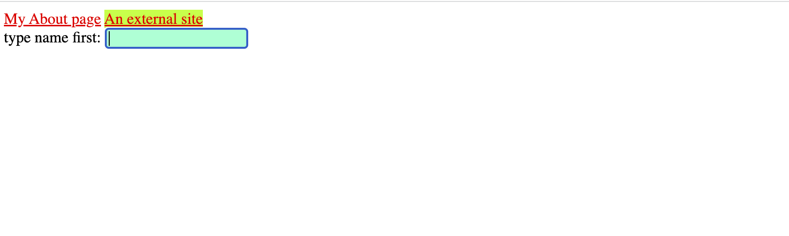<br>
    - **UI-State Pseudo-Classes**(:enabled, :disabled, :checked, :intermediate, :default, :valid, :invalid, :in-range, :out-range, :required, :optional, :read-write, :read-only).
        - html
            ```
            <label for="">Name : </label><input type="text" class="inp-name" disabled><br>
            <label for="">Title: </label><input type="text" class="title"><br>
            <label for="">Email: </label><input type="text" class="email"><br>
            <label for="">one</label><input class="one" type="radio" checked>
            <label for="">two</label><input class="two" type="radio">
            <label for="">three</label><input class="three" type="radio">
            <label for="">four</label><input class="four" type="radio">
            ```
        - css
            ```
            .inp-name:disabled{
                border: 2px solid red;
            }
            .title:enabled{
                border: 2px solid green;
            }
            .one:checked{
                /* set properties if radio is checked */
            }
            ```
        <br>
    - <u>Optionality pseudo-classes</u>
        - html
            ```
            <input type="email" placeholder="enter an email address" required>
            <input type="email" placeholder="optional email address">
            <input type="email" placeholder="optional email address" required="false">
            ```
        - css
            ```
            input:required {
            border: 1px solid #f00;
            }
            input:optional {
            border: 1px solid #ccc;
            }

            OR

            <!-- optionally selecting with the help of attribute [required] -->
            input[required] {
            border: 1px solid #f00;
            }
            input:not([required]) {
            border: 1px solid #ccc;
            }

            Discussion: required = "false" ==> optional
            ```
        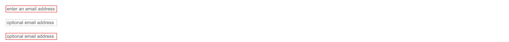<br>
    - <u>Validity pseudo classes</u>
        - html
            ```
            <input type="email">
            <input type="email">
            ```
        - css
            ```
            input[type="email"]:focus {
            background-position: 100% 50%;
            background-repeat: no-repeat;
            }
            input[type="email"]:focus:invalid {
            /* background-image: url(warning.jpg); */
            background-color: rgb(222, 90, 90);
            }
            input[type="email"]:focus:valid {
            /* background-image: url(checkmark.jpg); */
            background-color: rgb(114, 232, 114);
            }
            ```
            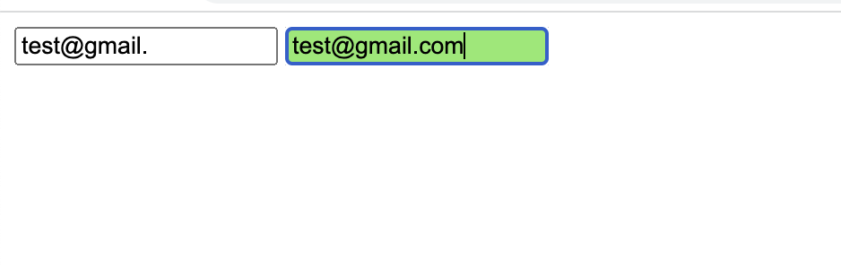<br>
            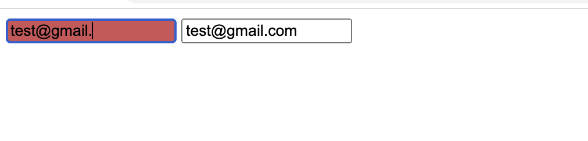<br>
    - <u>Range pseudo-classes</u>
        - html
            ```
            <input id="nickels" type="number" min="0" max="1000"/>
            ```
        - css
            ```
            input[type="number"]:focus {
            background-position: 100% 50%;
            background-repeat: no-repeat;
            }
            input[type="number"]:focus:out-of-range {
            /* background-image: url(warning.jpg); */
            background-color: red;
            }
            input[type="number"]:focus:in-range {
            /* background-image: url(checkmark.jpg); */
            background-color: green;
            }
            ```
        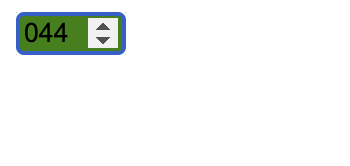<br>
        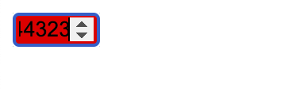<br>
    - <u>Mutability pseudo-classes</u>
        - html
            ```
            <textarea disabled></textarea>
            <pre contenteditable>Type your own code!</pre>
            ```
        - css
            ```
            textarea:read-only {
            opacity: 0.75;
            }
            pre:read-write:hover {
            border: 1px dashed green;
            }

            Discussion: text area is not editable and pre is editable
            ```
        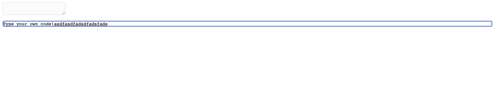<br>
    - <u>The negation pseudo class</u>
        - html
            ```
            <div class="one"> 
                <div class="two">
                    <p>I'm a paragraph!!</p> 
                </div>
            </div>
            ```
        - css
            ```
            div:not(.one) p {
            font-weight: bold;
            }

            Discussion: Check here that we are not electing one then other div that is with class = two got selected and it is styled as bold.
            ```
        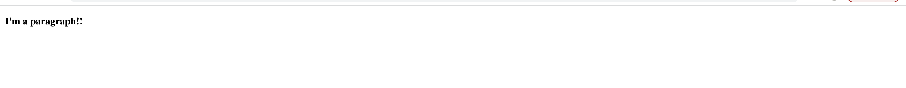<br>

### **Pseudo Element Selector**
- <u>styling first element</u>
    - html
        ```
        <h2>Hi there styling first letter..</h2>
        <p>
            The first letter is defined as the first typographic <br>
            letter unit of the originating element, if it is not <br>
            preceded by other content, like an image. The specifications <br>
            use “letter unit” because some languages have letters ma
        </p>
        ```
    - css
        ```
        h2::first-letter{
        font-weight: 300;
        color: red;
        }

        p::first-line{
        color: brown;
        font-size: x-large;
        }

        Discussion: The ::first-letter and ::first-line pseudo-elements currently can be applied only to block-display elements
        ```
    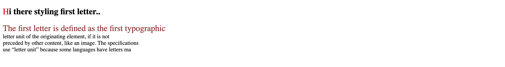<br>
- <u>Styling (or Creating) Content Before and After Elements</u>
    - html
        ```
        <h2>Hi there styling first letter..</h2>
        <p>
            The first letter is defined as the first typographic <br>
            letter unit of the originating element, if it is not <br>
            preceded by other content, like an image. The specifications <br>
            use “letter unit” because some languages have letters ma
        </p>
        ```
    - css
        ```
        h2::before {
        content: "]]";
        color: silver;
        }
        body::after {
        content: "The End.";
        }
        ```
    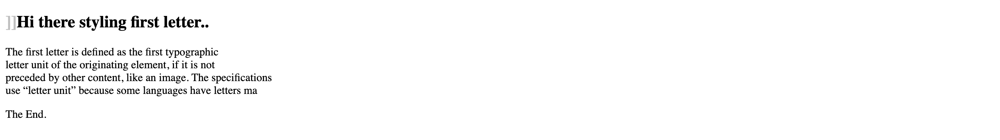<br>
            


