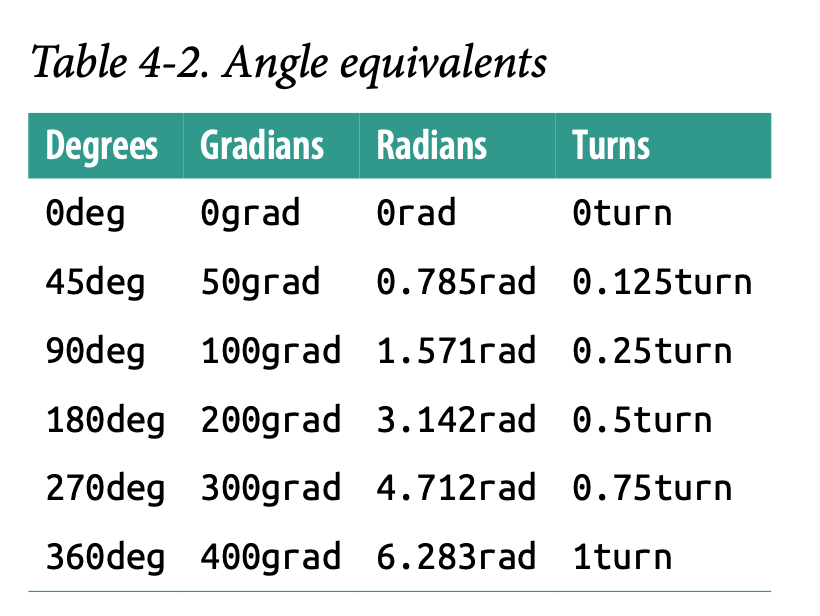

### **Values and units**
- When ever you define a **property** in css you give **values** to them we are going to understand such **values** and **units** in this section.

- **KeyWords, Strings and Other text values**
    - css
        ```
        a:link, a:visited {text-decoration: none;}

        Discussion: none is a keyword.
        ```
    - **Global keywords** CSS3 defines global keyword that are accepted by every property, the global keywords are **inherit**, **initial**, and **unset**.
        - **inherit** this makes the value of the property same as that of the parent.
            - html
                ```
                <div id="toolbar">
                    <a href="../html/01 forSlibingConfussion.html">One</a> | 
                    <a href="../html/02. pseudoClassSelector.html">Two</a> |
                    <a href="../html/02. pseudoClassSelector.html">Three</a>
                </div>
                ```
            - css
                ```
                #toolbar {
                background: blue;
                color: white;
                }
                #toolbar a {
                color: inherit;
                }
                ```
        - **initial** this will reset the value of the property.
            - css
                ```
                #toolbar {
                background: blue;
                color: white;
                }
                #toolbar a {
                color: initial;
                }
                ```
        - **unset** this keyword acts as a universal stand in for both inherit and initial.If the property is inherited, then unset has the same effect as if inherit was used. If the property is not inherited, then unset has the same effect as if initial was used.
    - **Strings** if you want to use " inside 'dummy text' you can do it. If you want to add " inside "" then you can add \ before ".
        - html
            ```
            <p>
                "I've always liked to play with strings." <br>
                'He said to me, "I like to play with strings."' <br>
                "It's been said that \"haste makes waste\""
            </p>
            ```
    - **URL's**
        - css
            ```
            body {
            background: url(http://www.pix.web/picture1.jpg);
            }
            ```
- **Numbers and Percentages**
    - css
        ```
        p{
            margin: 10px;
            left: 2%;
        }

        Dcisussion: 10, 2% are the way thorugh which we can give values to the properties.
        ```
- **Distances** Many CSS properties are such as margin depends on the length mesurements to properly display various page elements. The length units are divided into two groups.
    1. Absolute length
        - Inches (in).
        - Centimeters (cm).
        - Millimeters (mm).
        - Quarter-millimeters (q): There are 40q in one cm.
        - Points (pt): There are 72p in one in.
        - Picas (pc): 1pc = 12 pt.
        - Pixels (px): 
        - **Resolution units**
            - Dots per inch(dpi)
            - Dots per cm(dpcm)
            - Dots per pixel unit(dppx): 1dpps = 96dpi
    2. **relative length** is mesured with respect to screen resolution, width of view area, etc.
        - **em, ex, rem** units: **1em** = **14px**. **ex**, on the other hand, refers to the height of a lowercase x in the font being used. em, rem, ex are related to the fonts. rem referes to the size of root element.
            - html
                ```
                <p> This paragraph has the same font size as the root element thanks to inheritance.</p>
                <div style="font-size: 30px; background: silver;">
                    <p style="font-size: 1em;">This paragraph has the same font size as its parent
                        element.</p>
                    <p style="font-size: 0.75rem;">This paragraph has the same font size as the root
                        element.</p>
                </div>

                Discussion: parent font-size is 30px and child font-size is 0.75rem which shows that 0.75 relative am to parent font-size.
                ```
        - **view port relative units**
            - Viewport width unit (vw): This unit is calculated with respect to the viewport’s width. **1vw=9.37px**
            - Viewport height unit (vh): This unit is calculated with respect to the viewport’s height. **1vh=6.5px**
            - Viewport minimum unit (vmin): This unit is 1/100 of the viewport’s width or height, whichever is lesser. **1vmin=6.5px.**
            - Viewport maximum unit (vmax): This unit is 1/100 of the viewport’s width or height, whichever is greater. **1vmax=9.37px.**
            - html
                ```
                <div style="width: 99vw; height: 97vh; background-color: aqua;">
                    <div style="width: 10vw; height: 10vh; background-color: bisque;">

                    </div>
                </div>

                Discussion: vw and vh are resizable when you drag your page it's going to change automatically. Please check how amazon and flipkart websites are having resizable width but the height is not changeable. you can scroll all the way to the bottom verdically. vertical size is not going to change only horizontal size is getting changed.
                ```
- **Angles** There are four units of angles [deg, grad, rad, turn]
    - <br>

        
        


