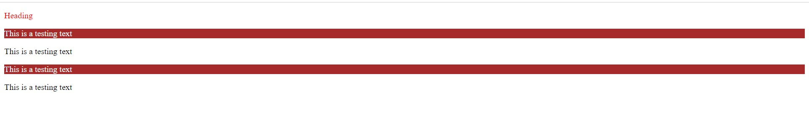

- Selectors and Properties
  - A way of grabing a element from html document and styling it when necessary.
    - element
    - **Class Selector**
      - If you want specific **p** tag with test calls to get styles then you can also do it as below.
      - If you want to use multiple classes to one element tag then that also you can do see new-para and style-para classes.
        ```
        <!-- HTML -->
        <body>
        <p class="heading">Heading</p>
        <p class="testing">This is a testing text</p>
        <p class="new-para style-para">This is a testing text</p>
        <p class="testing">This is a testing text</p>
        <p class="test-para">This is a testing text</p>
        </body>

        <!-- CSS -->
        p.testing{
            background-color: azure;
            color: blue;
        }
        p.heading{
            color: red;
        }
        ```
        <br>
    - **Id Selector**
        - In some ways ID's selectors are as same as that of the Class selectors, but there are some **crutual differences**
            - Class declaration starts with **"."** while ID declaration starts with **"#"**
            - We can define multiple classes for one element but we can not use multiple ID's for single element.
                ```
                <!-- HTML -->
                <p id="test">id selector testing</p>
                <p id="test test2">id selector testing</p>
                <p id="test">id selector testing</p>
                <p id="test">id selector testing</p>

                <!-- CSS -->
                #test{
                color: aqua;
                background-color: chocolate;
                }
                #test2{
                    color: blue;
                    background-color: burlywood;
                }
                ```
                <br>
            - In the above example we are having multiple ID's in the HTML document but take example of **getElementById** method there you would be getting multipe elements if you are specifying same ID's to the element, and in many cases we intend to pick one elemet with the id for dom manupulation.
    - **Attribute Selectors** There are four major attribute selectors *simple attribute selector, exact attribute value selector, partical match attribute value selectors and leading attribute value selector*
        - **Simple attribute selector** here you have to specify the tag name and the attribute in **"[]"** square brackets. If you want to go more specifc to a particular element, then we can further specify the next attribute check below example for **W3C** link.
            ```
            <!-- HTML -->
            <p class="test">Attr selector one</p>
            <p id="id-test">Attr selector tow</p>
            <p>Attr selector three</p>
            <p>Attr selector four</p>
            <a href="http://www.w3.org/" title="W3C Home">W3C</a><br /> 
            <a href="http://www.webstandards.org">Standards Info</a><br /> 
            <a title="Not a link">dead.letter</a>

            <!-- CSS -->
            .test{
                color: green;
                background-color: bisque;
            }
            #id-test{
                color: aquamarine;
                background-color: chocolate;
            }
            p[class]{
                font-size: large;
            }
            p[id]{
                border: 5px solid black;
            }
            a[href][title] {
                font-weight: bold;
                background-color: beige;
            }
            ```
            <br>
        - **Selection Based on Exact Attribute Value** If you want to select an element with attribute and having some specific value assigned to it then you can use attribute value selector.
            ```
            <!-- HTML -->
            <p id="id-test">Attr selector tow</p>
            <a href="http://www.w3.org/" title="W3C Home">W3C</a><br />

            <!-- CSS -->
            p[id=id-test]{
                color: blueviolet;
                background-color: aquamarine;
            }
            a[href='http://www.w3.org/'][title='W3C Home']{
                color: black;
                background-color: yellow;
                font-weight: bolder;
            }
            ```
            <br>
        - **Selection based on Partial Values** There would be situations where you need to select element on the basis of partial attribute values in such scenarios you can use below technique.
            ```
            [foo~="bar"] = Selects any element with an attributefoowhose value contains the word bar in a space-separated list of words

            [foo*="bar"] = Selects any element with an attribute foo whose value contains the substring bar

            [foo^="bar"] = Selects any element with an attribute foo whose value begins with bar
            
            [foo$="bar"] = Selects any element with an attribute foo whose value ends with bar

            [foo|="bar"] = Selects any element with an attribute foow hose value starts with bar followed by a dash (U+002D) or whose value is exactly equal to bar
            ```
        - **Using document structure**
            ```
            <html>

            <head>
                <base href="http://www.meerkat.web/">
                <title>Meerkat Central</title>
            </head>

            <body>
                <h1>Meerkat <em>Central</em></h1>
                <p>
                    Welcome to Meerkat <em>Central</em>, the <strong>best meerkat web site on <a href="inet.html">the
                            <em>entire</em> Internet</a></strong>!</p>
                <ul>
                    <li>We offer: <ul>
                            <li><strong>Detailed information</strong> on how to adopt a meerkat</li>
                            <li>Tips for living with a meerkat</li>
                            <li><em>Fun</em> things to do with a meerkat, including:
                                <ol>
                                    <li>Playing fetch</li>
                                    <li>Digging for food</li>
                                    <li>Hide and seek</li>
                                </ol>
                            </li>
                        </ul>
                    </li>
                    <li>...and so much more!</li>
                </ul>
                <p>
                    Questions? <a href="mailto:suricate@meerkat.web">Contact us!</a> </p>
            </body>

            </html>
            ```
            <br>
            - **Descendent selector** will select only element which are descended from a specific element which we have specified.
                ```
                <!-- CSS -->
                h1 em{
                    color: grey;
                }

                ul li ul li em {
                    color: gray;
                    font-weight: bolder;
                    background-color: chartreuse;
                }
                ``` 
                <br>
            - **Selecting Specific Child** If you don't want to choose any arbitary element and narrow down your selection to a specific element.
                ```
                p > em{
                    color: blue;
                    background-color: cornflowerblue;
                    border: 2px solid black;
                }
                ```
                <br>
            - **Pseudo class selectors**
            
            - **WE HAVE SIBLING SELECTORS AS WELL BUT WE'LL DISCUSS THAT LATER**


