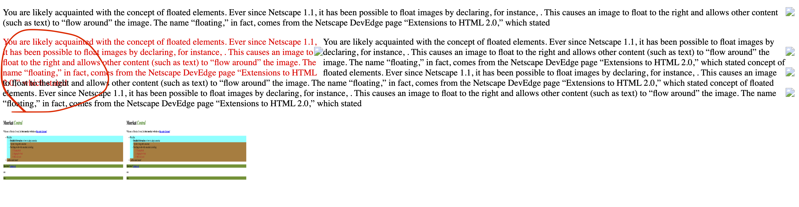
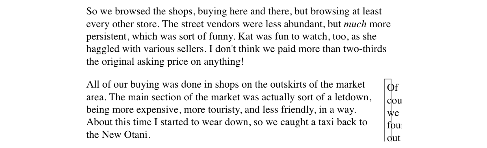

### Floats and Shapes
- Floats are not meant to be a layout for designing you web page. Recent addition of Float shapes allows you to creation of non rectrangular shapes.
- **Floating**
    - When we are making a img tag align to right it is floated to right and other content wraps around it.
    - html
        ```
        <body>
            <p>You are likely acquainted with the concept of floated elements. Ever since Netscape 1.1, it has been possible to float images by declaring, for instance, . This causes an image to float to the right and allows other content (such as text) to “flow around” the image. The name “floating,” in fact, comes from the Netscape DevEdge page “Extensions to HTML 2.0,” which stated</p>
            <span style="float: left; color: red; width: 40vw; height: 15vh;">You are likely acquainted with the concept of floated elements. Ever since Netscape 1.1, it has been possible to float images by declaring, for instance, . This causes an image to float to the right and allows other content (such as text) to “flow around” the image. The name “floating,” in fact, comes from the Netscape DevEdge page “Extensions to HTML 2.0,” which stated</span>
            <p>You are likely acquainted with the concept of floated elements. Ever since Netscape 1.1, it has been possible to float images by declaring, for instance, . This causes an image to float to the right and allows other content (such as text) to “flow around” the image. The name “floating,” in fact, comes from the Netscape DevEdge page “Extensions to HTML 2.0,” which stated concept of floated elements. Ever since Netscape 1.1, it has been possible to float images by declaring, for instance, . This causes an image to float to the right and allows other content (such as text) to “flow around” the image. The name “floating,” in fact, comes from the Netscape DevEdge page “Extensions to HTML 2.0,” which stated concept of floated elements. Ever since Netscape 1.1, it has been possible to float images by declaring, for instance, . This causes an image to float to the right and allows other content (such as text) to “flow around” the image. The name “floating,” in fact, comes from the Netscape DevEdge page “Extensions to HTML 2.0,” which stated</p>
            
            
        </body>
        ```
    - css
        ```
        .img-style{
            height: 30vh;
            width: 50vh;
            float: left;
        }
        ```
    <br>
    - Observations and important points
        - IF you could see all the items are getting floated to left and other text / other content getting wraped around it.
        - Float not only affects it's position but it also affects other elements in the document. 
        - Float affects the normal flow of html which is block and inline.
        - So when the element if floated **other elemets flows around** it that is what the concpet of float is.
        - You **must give width** to the floated elemets else you will below result by default html will consider the width of a floated element as one charter wide.<br>
            <br>
        - If you do not want to float the element at all then use **float: none**
        - When we set **float: right|left** then by default the display property of that element is **block**. Event though a tag is inline still float will make it as a block.
            <br>
        - Check above issue we can see that float is making the **span as block** again if you are not specifying enough height to your floated elemets then other contents will overlap it. so give the height and width properly so that other contents will not overlaps your content.  
    - **-ve/+ve Margins**
        - Float's can make them move out of there parent plane with the help of **-ve/+ve** margins
        <br>
- **Shapes**