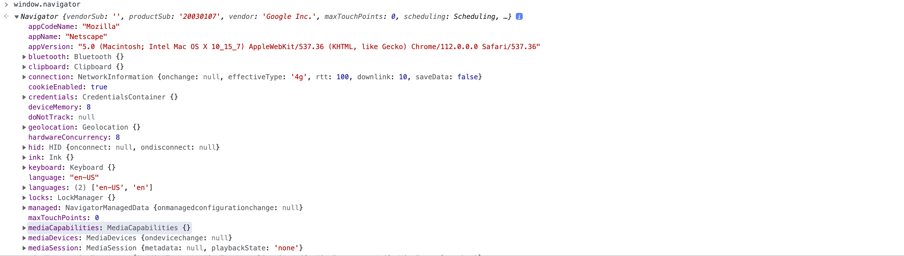
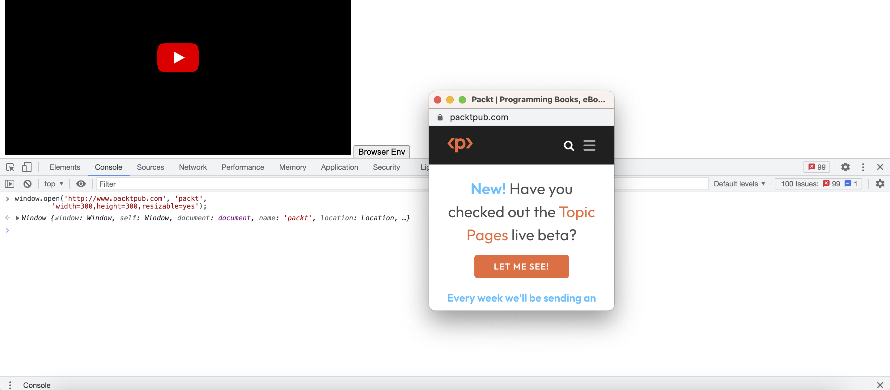
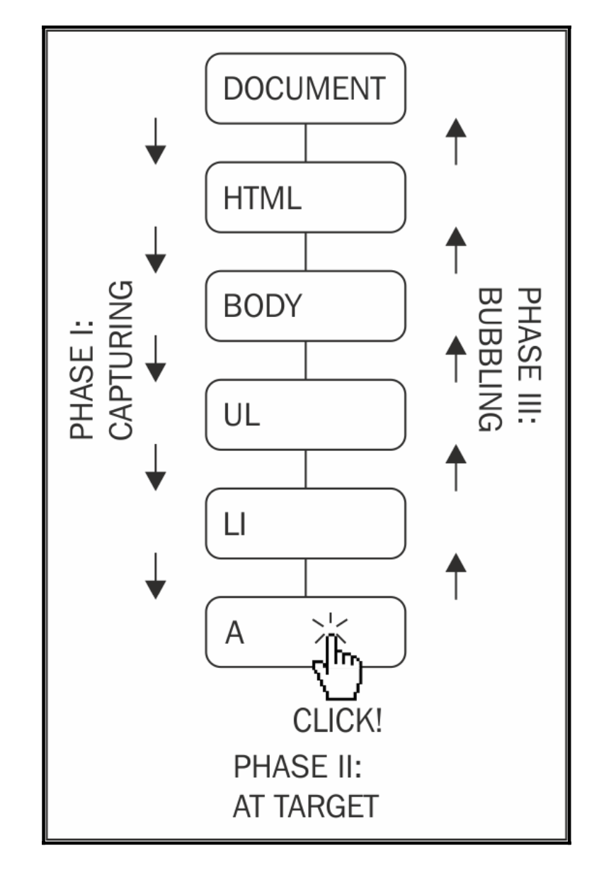

### Browser Environment
- Key points to get from here
    - The Browser Object Model (BOM) 
    - The Document Object Model (DOM) 
    - Browser events
    - The XMLHttpRequest object
- The javascrit code has access to multiple objects. These objects can be categorised into three grounps.
    1. **Core ECMAScript objects**: Consists of all normal objects that we have discussed previously in the notes. Array, String, Boolean, Number, Object, Function, .....
    2. **DOM**[Document Object Model]: This consists of all the objects that have to do with the currently loaded page/ currently loaded Document
    3. **BOM** [Browser Object Model]: This consists of objects that deals with everything outside the page [The browser window and the desktop screen].
- **BOM** The BOM is a collection of objects that gives you access to browser and desktop screen. These objects are accessible through the global object window.
    - There is a window object for every popup, iframe, frame, or browser tab.
    - The BOM can vary from browser to browser.
    - **navigator property**
        - **userAgent** property
            ```
            window.navigator.userAgent

            <!-- output -->
            'Mozilla/5.0 (Macintosh; Intel Mac OS X 10_15_7) AppleWebKit/537.36 (KHTML, like Gecko) Chrome/112.0.0.0 Safari/537.36'
            ```
            <br>
    - **Location property** location property points to a object which points to the URL of the currently loaded page.
        - location.href is the full URL.
        - location.hostName is only the domain.
        - with the help of **window.location.reload()** you can reload the page.
    - **history property**
        - **window.history.length** you can access number of pages users has visited before comming to your page.
        - **window.history.back()** for going one step back from where user has visited
        - **window.history.forward()** if user is in the middle then you can go next page which was already visited by user with the help of this method.
        - **window.history.go(0)** use this for reloading the current page.
    - **frame property**
        - **window.frame** gives you number of frames you have on the browser curenct page
        - from the parent page you can also access the properties of child frames as well.
        - from inside child you can also access the parent. There are multiple usage of frames hence this object if usefull to deal with frames in HTML.
    - **screen property** This property provides information about the environment outside the browser.
        - **window.screen.colorDepth** used for statistical purposes. 
        - we have multiple properties like window.screen.width, window.screen.availableWidth, window.screen.height, window.screen.available height
        - you can explore more inside window.screen property.
    - **open()/close()** These methods helps us to open/close new tabs in the browser.
        - **window.open**('http://www.packtpub.com', 'packt','width=300,height=300,resizable=yes');
        <br>
        - **window.close()** will close the new window.
    - **alter(), prompt(), confirm()** window methods.
        - **window.alert()** will give you alert with ok option.
        - **window.confirm** will give you two option cancle and ok
            ```
            let testing = window.cofirm();
            console.log(testing);

            Discussion: click on OK you will get true in the testing
                        click on cancle you will get false in the testing.
            ```
        - **window.prompt()**
            ```
            let test = window.prompt();
            console.log(test); 

            Discussion: what ever you enter inside the prompt that string you will get into the test variable.
            ```
    - **setTimeout and setInterval** methods allows you to schedule execution of a piece of code.
        ```
        function test(){
            console.log("testing");
        }
        setTimeout(test, 2000);

        <!-- output -->
        3
        testing

        
        Discussion: 3 is the id of the setTimeout
        ```
        ```
        function test(){
            console.log("testing");
        }
        let id = setInterval(test, 1000);
        setTimeout(()=>{
            clearInterval(id);
        }, 3000);


        Discussion: Will output testing two times
            After that when we clearInterval after 3 secs it setInterval will stops it's execution.
        ```

- **DOM** Document Object Model. DOM represents an XML, HTML document as a tree of nodes. Using DOM you can access any element in the HTML document and you can **modify, remove or add new elements** into the document. DOM is a language independent API which can be implemented in any programming language not just javascript. If you are commenting any code in HTML you can see that is also a node in DOM.
    - Each and every tag is a object there are some specific properties and methods attached to it for manupulation. Constructor functions are there for each and every node from which you can check how that node has been created.
        - **```<p>```** has been created with the help of HTMLParagraphElement() constructor function.
        - **```<head>```** has been created with the help of HTMLHeadElement() constructor function and so on..

### **DOM Access, Modify, Create, Remove operations.**
USE **https://www.phpied.com/files/jsoop/ch7.html** FOR PRACTICING BELOW METHODS.
- **Accessing DOM**
    - **document node** gives you the access to the current document. 
        ```
        document.nodeType // 9
        document.nodeName // "#document"
        document.nodeValue // null

        
        Discussion: There ae 12 node types represented by integers. The document nodeType is 9. The most commonly used are 1(element), 2(attribute), 3(text). 
        ```
    - **documentElement** The root of html document is **```<html>```** tag. To access the root element you can access documentElement property of document.
        ```
        document.documentElement
        document.documentElement.nodeType // 1
        document.documentElement.nodeName // HTML
        document.documentElement.nodeValue // null
        ```
    - **child nodes** In order to check that a element has child node we can use **hasChildNodes()**
        ```
        document.documentElement.hasChildNodes(); // true
        document.documentElement.childNodes[0]; // <head>....</head>
        document.documentElement.childNodes[1]; // #text
        document.documentElement.childNodes[2]; // <body>....</body>
        ``` 
        - Any child node has access to it's parent node
            ```
            document.documentElement.childNodes[1].parentNode;//
            ```
    - **Attributes**
        ```
        let body = document.documentElement.childNodes[2];
        body.childNodes.length;
        body;

        <!-- output -->
        <body>
           <p class="opener">first paragraph</p>
           <p><em>second</em> paragraph</p>
           <p id="closer">final</p>
           <!-- and that's about it -->
        </body>
        ```
        ```
        body.childNodes[1]; // <p class="opener">first paragraph</p>
        body.childNodes[1].hasAttributes(); // true
        body.childNodes[1].attributes.length; // 1
        body.childNodes[1].attributes[0].nodeName; // class
        body.childNodes[1].attributes[0].nodeValue; // 'opener'
        body.childNodes[1].attributes['class'].nodeName; // class
        body.childNodes[1].getAttribute('class'); // 'opener'
        ```
    - **Accessing Contents inside tag**
        ```
        body.childNodes[1].nodeName; // 'P'
        body.childNodes[1].textContent; // 'first paragraph'
        body.childNodes[1].innerHTML; // 'first paragraph'
        ```
    - **DOM Access shortcuts** There are multiple shortcut methods but mostly used  while codding are 
     **getElementsByTagName(), getElementsByName(), and getElementById()**
        ```
        document.getElementsByTagName('p').length; // 3
        document.getElementsByTagName('p')[0]; // <p class="opener">first paragraph</p>
        document.getElementsByTagName('p')[1]; // <p><em>second</em> paragraph</p>
        document.getElementsByTagName('p')[2];// <p id="closer">final</p>

        document.getElementsByTagName('p')[0].innerHTML; // first paragraph
        document.getEmlementById('closer'); // <p id="closer">final</p>
        document.getElementByClassName('opener')// <p class="opener">first paragraph</p>
        ```
    - **Modifying DOM nodes**
        ```
        let element = document.getElementById('closer');
        element.innerHTML = 'dummy text';

        Discussion: Changing text inside the tag
        ```
        ```
        let element = document.getElementById('closer');
        element.innerHTML = '<p>hello world....</p>'

        Discussion: Adding one html node into element.
        ```
        ```
        element.style.border = "1px solid green"

        Discussion: Adding style to the last element.
        ```
    - **Creating New nodes** for creating new node you can use **createElement() and createTextNode()** methods. Once you have the new nodes then you can add them using **appendChild(), insertBefore(), or replaceChild()** mthods.
    USE **http://www.phpied.com/files/jsoop/ch7.html** for below methods implementation.
        ```
        let pEle = document.createElement('p');
        pEle.innerHTML = 'dummy text for new p';
        document.body.appendChild(pEle);
        ```
    - **Removing Nodes** you can use removeChild() method for removing element from the document.
        ```
        document.body.removeChild(pEle);
        ```
    - **Using document.write() method**  document.write() methods allows you to insert html into your document while it's being loaded.
        ```
        <p>It is now
                <script>
                document.write("<em>" + new Date() + "</em>");
                </script>
        </p>
        ```
    
- **Cookies, title, referrer, and domain**
    - **document.cookies** is a property that contains a string this string is the content of the cookies exchanged between server and the front end
    - **document.title** helps you to change the name of the tab. document.title = 'new Tab';
    - **document.referrer** gives you the information of previously visited page.
    - **document.domain** gives you access of domain name of currently loaded page.
        - This is commonly used when you need to perform so-called domain relaxation. Imagine your page is www.yahoo.com, and inside it, you have an iframe hosted on music.yahoo.com subdomain. These are two separate domains, so the browser's security restrictions won't allow the page and the iframe to communicate. To resolve this, you can set document.domain property on both pages to yahoo.com and they'll be able to talk to each other
- **Events** Just take one example of one event[suddenly it starts raining in summer].
    - 1st listner: great there will be some releif from this summer.
    - 2nd listner: shit i keep my clothes outside why not it is raining in this hot summer<br>
So from above we can say there **will be multiple listner to the same event**. Same happens in javascript lets say the event is a **user-click** you code can **behave differently** on the basis of **call-back** function that you have written to deal with the **click event**.
    ```
    let firstElemet = document.getElementsById('p')[0];
    firstElemet.onclick = function(){
        console.log('hello world');
    };
    ```
    ```
    let secondP = document.getElemetsById('p')[1];
    secondP.addEventListener('click', ()=>{
        console.log('2nd p with add event listner');
    },false);
    ```
- **Capturing and Bubbling** in the above example there is 3rd parameter to the addEventListener which we keept as false, let's see what it is.
    ```
    <body> 
        <ul>
            <li><a href="http://phpied.com">my blog</a></li>
        </ul>
    </body>


    Discussion: When you are clicking on link you are not just clicking on link you are clicking on li, ul and even on body or we can say on whole document this is called event propogation.
    ```
    - The process of propogation can be implemented with the help of two ways
        1. Event Capturing: Click happens to the body first then propogated to the inner objects the body, the ul, the li and then the link.
        2. Event Bubbling: Click happens to the link and then bubbles up to the document.
- <br>
    - The third parameter specifies whether or not capturing is should be used. It's better to use bubbling.
    - You can **stop the propagation** of the event in your listeners so that it **stops bubbling** up and never reaches the document. To do this, you can call the **stopPropagation()** method of the event object.
    - You can also use **event delegation**. If you have ten buttons inside ```<div>```, you can always attach **ten event listeners**, one for each button. However, a smarter thing to do is to attach only one listener to the wrapping ```<div>``` and once the event happens, check which button was the target of the click.
- **stopPropogation**
    ```
    let secondPara = document.getElementsByTagName('p')[1];
    secondPara.addEventListener('click', (e)=>{
        console.log('second para clicked');
        e.stopPropagation();
    }, false);


    Discussion: e.stopPropogation() will stop bubbling 

    Always remember you have to create a function and then pass to the addEventListner this is becuase while removing eventListner you have to pass the reference to your created function.
    ```
- **PreventDefault behaviour** Some browsers have predefined behaviour like opening a link in new window. so by callig preventDefault() on event object will desable the default behaviour.

- **cross browser implementation of above methods**
    ```
    function callback(evt) {
            // prep work
            evt = evt || window.event;
            var target = evt.target || evt.srcElement;
            // actual callback work
            console.log(target.nodeName);
    }
        //  start listening for click events
        if (document.addEventListener) { // Modern browsers
            document.addEventListener('click', callback, false);
        } else if (document.attachEvent) { // old IE
            document.attachEvent('onclick', callback);
        } else {
            document.onclick = callback; // ancient
    }
    ```


